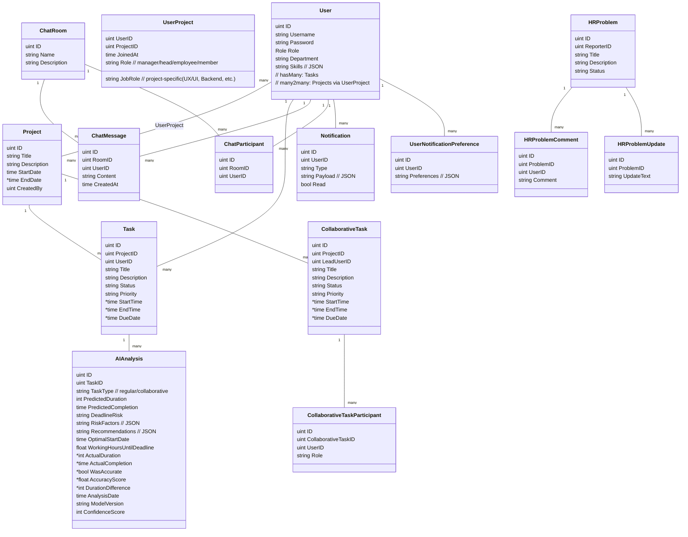

## Project X — Architecture Diagrams

This document provides system-level and feature-level diagrams. Diagrams use Mermaid; render in any Mermaid-enabled viewer or IDE.

### 1) System overview

```mermaid
flowchart LR
  subgraph Client
    UI[Web UI / Mobile]
  end

  subgraph Server(Go)
    Gin[REST API (Gin)]
    MW[Auth + RBAC Middleware]
    Handlers[Handlers]
    Services[Domain Services]
    WS[WebSocket Hub]
  end

  subgraph AI
    Gemini[Google Gemini 2.0 Flash]
  end

  subgraph DB
    PG[(PostgreSQL + GORM)]
  end

  UI <--> Gin
  Gin --> MW --> Handlers --> Services --> PG
  Services <---> Gemini
  UI <--> WS
```

### 2) Request lifecycle and RBAC


### 3) Data model (key entities and relations)



### 4) AI Project Task Generation (preview then confirm)


### 5) AI Time Optimizer (caching + learning)


### 6) AI Chat Assistant (private room + @ai mentions)


### 7) Real-time chat and membership


### 8) Notifications (current DB-level + extensible channels)


### 9) Arabic working schedule constraints


### 10) Deployment and configuration


